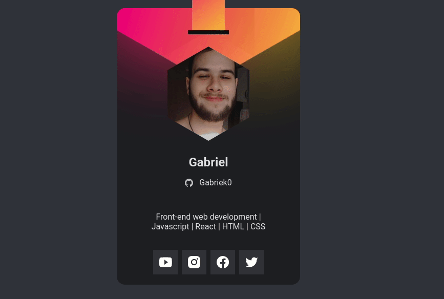

<h1 align="center"> 
    Crachá Virtual DoWhile - Trilha Origin
</h1>

  <a href="#-tecnologias">Tecnologias</a>&nbsp;&nbsp;&nbsp;|&nbsp;&nbsp;&nbsp;
  <a href="#-projeto">Projeto</a>&nbsp;&nbsp;&nbsp;|&nbsp;&nbsp;&nbsp;

 

</img>

## 🚀 Tecnologias

O projeto juntamente com as animações foram desenvolvidas com as seguintes tecnologias:

- HTML
- CSS
- JavaScript
- [Vanilla-tilt](https://micku7zu.github.io/vanilla-tilt.js/index.html)

 

## 💻 Projeto

O Crachá virtual DoWhile foi desenvolvido durante a semana Next Level Week Heat da Rocketseat, como um pré aquecimento para o evento DoWhile.
